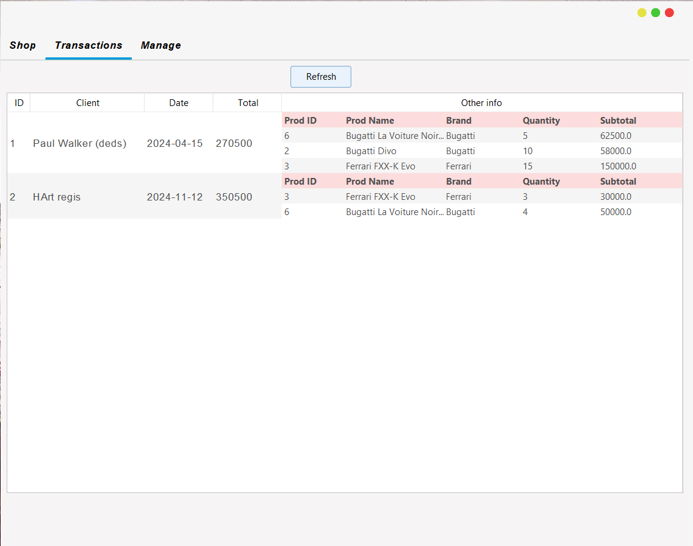
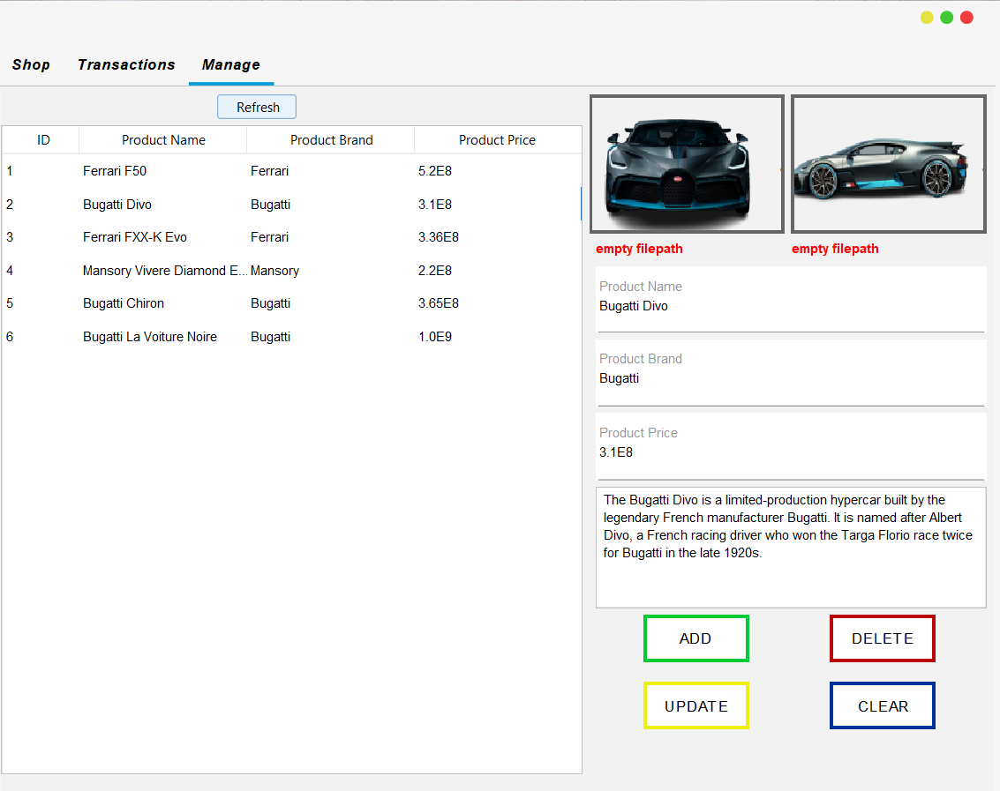

#  CarStore

A desktop-based **Point of Sale (POS) and Car Management System** built with **Java** and **MySQL**. CarStore provides a simple interface for browsing vehicles, managing products, handling customer purchases, and keeping transaction records.

> **Built in 2023 B.A. — Before AI.** 🗿
> Back when debugging meant staring at Stack Overflow for 3 hours and questioning your life choices.

## ✨ Key Features

* 🚘 **Car Showcase** — Browse available cars through an animated vehicle showcase.
* 🔊 **Animation & Sound** — Car showcase animations are accompanied by sound for a more interactive experience.
* 🛒 **Shopping Cart** — Add and manage selected vehicles before completing a transaction.
* 💳 **Point of Sale** — Process customer purchases through a centralized POS workflow.
* 📦 **Product Management** — Add, update, view, and manage available cars and their information.
* 📊 **Transaction Reports** — View recorded sales and transaction history for monitoring and reporting.
* 🗄️ **MySQL Database** — Stores product, transaction, and other application data persistently.

## 🛠️ Tech Stack

* **Java**
* **Java Swing**
* **MySQL**
* **JDBC**

## 🎬 Car Showcase

An animated showcase provides a more interactive way of presenting vehicles, combining visual animation with sound.

https://github.com/user-attachments/assets/REPLACE-WITH-UPLOADED-VIDEO

> GitHub README files do not reliably render repository `.webm` files directly. For the best preview, upload `readme-assets/demo.webm` to a GitHub issue, pull request, or README editor, then paste the generated GitHub attachment URL above.

## 🖼️ Screenshots

### Transaction Management

View and manage recorded sales and transaction information.



### Product Management

Manage cars and their associated product information.



## 🎯 Purpose

CarStore was developed as a **Java desktop POS project** for managing the basic sales workflow of a car store. It combines product management, cart functionality, transaction processing, and sales reporting in one application.

The project also experiments with making traditional desktop applications more interactive through an **animated car showcase with sound**, rather than limiting the interface to standard forms and tables.

## 📁 Project Structure

```text
CarStore/
├── readme-assets/
│   ├── demo.webm
│   ├── 1.png
│   └── 2.png
├── src/
├── README.md
└── ...
```

## 🕰️ A Piece of History

```text
Year: 2023 B.A.
Meaning: Before AI
Developer fuel: Stack Overflow + YouTube + pure suffering
AI-generated code: 0%
Character development: 100%
```

> *"We didn't ask AI why the code wasn't working. We added another `System.out.println()`."* ☕

---

**CarStore** — Java + MySQL POS & Car Management System
*Handcrafted in the ancient era of 2023 B.A. (Before AI).* 🗿
